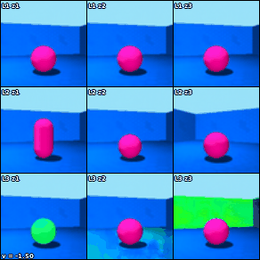
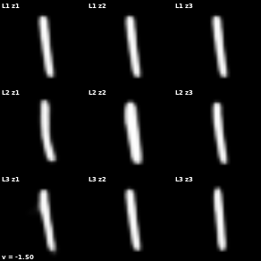
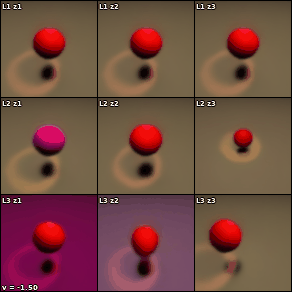
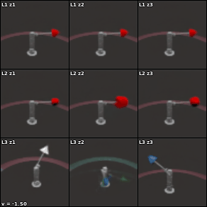
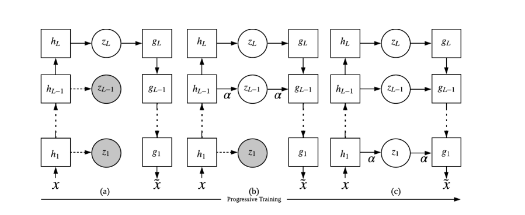

# pytorch pro-VLAE

[](https://github.com/suzuki-2001/pytorch-proVLAE/actions/workflows/black-format.yaml)
[](https://github.com/suzuki-2001/pytorch-proVLAE/actions/workflows/validate-mamba-env.yaml)

</br>

This is a PyTorch implementation of the paper [PROGRESSIVE LEARNING AND DISENTANGLEMENT OF HIERARCHICAL REPRESENTATIONS](https://openreview.net/forum?id=SJxpsxrYPS) by Zhiyuan et al, [ICLR 2020](https://iclr.cc/virtual_2020/poster_SJxpsxrYPS.html).
The official code for proVLAE, implemented in TensorFlow, is available [here](https://github.com/Zhiyuan1991/proVLAE).

</br>

<table>
<tr>
<td></td>
<td></td>
</tr>
<tr>
<td></td>
<td></td>
</tr>
</table>

⬆︎ Visualization of results when traversing the latent space of proVLAE trained on four datasets: 3D Shapes (top-left), MNIST (top-right), 3DIdent (bottom-left), and MPI3D (bottom-right). The results for the last two datasets are preliminary, with hyperparameter tuning still in progress..

&nbsp;

We modified the code to allow more flexible configuration of VAE architecture by specifying only z_dim, number of ladder layers, and input image size.
This implementation introduces dynamic size management for arbitrary input image sizes; it automatically calculates the maximum possible ladder layers based on input dimensions and adaptively handles latent space dimensionality. The network depth and feature map sizes are also adjusted automatically by calculating appropriate intermediate dimensions, while ensuring a minimum feature map size and proper handling of dimensions during flatten/unflatten operations.



> Figure 1: Progressive learning of hierarchical representations. White blocks and solid lines are VAE
> models at the current progression. α is a fade-in coefficient for blending in the new network component. Gray circles and dash line represents (optional) constraining of the future latent variables.

⬆︎ ladder and progressive learning of hierarchical representations.

&nbsp;

## Installation
We recommend using [mamba](https://mamba.readthedocs.io/en/latest/installation/mamba-installation.html)(via [miniforge](https://github.com/conda-forge/miniforge)) for faster installation of dependencies, but you can also use [conda](https://docs.anaconda.com/miniconda/miniconda-install/).
```bash
mamba env create -f env.yaml # or conda
mamba activate torch-provlae
```

&nbsp;

## Usage
You can train pytorch pro-VLAE with the following command. Sample hyperparameters and train configuration are provided in [scripts directory](./scripts/).
If a checkpoint is available, setting the mode argument to "visualize" allows you to only inspect the latent traversal, Please keep the parameter settings the same as checkpoint.

</br>

```bash
# all progressive training steps
python train.py \
        --dataset shapes3d \
        --mode seq_train \
        --batch_size 100 \
        --num_epochs 15 \
        --learning_rate 5e-4 \
        --beta 15 \
        --z_dim 3 \
        --hidden_dim 64 \
        --fade_in_duration 5000 \
        --optim adamw \
        --image_size 64 \
        --chn_num 3 \
        --output_dir ./output/shapes3d/

# training with distributed data parallel
torchrun --nproc_per_node=2 train_ddp.py \
    --distributed True \
    --mode seq_train \
    --dataset ident3d \
    --num_ladders 3 \
    --batch_size 128 \
    --num_epochs 30 \
    --learning_rate 5e-4 \
    --beta 1 \
    --z_dim 3 \
    --coff 0.5 \
    --hidden_dim 64 \
    --fade_in_duration 5000 \
    --output_dir ./output/ident3d/ \
    --optim adamw
```

</br>

| Argument | Default | Description |
|----------|---------------|-------------|
| `dataset` | "shapes3d" | Dataset to use (mnist, fashionmnist, dsprites, shapes3d, mpi3d, ident3d,celeba, flowers102, dtd, imagenet) |
| `data_path` | "./data" | Path to dataset storage |
| `z_dim` | 3 | Dimension of latent variables |
| `num_ladders` | 3 | Number of ladders (hierarchies) in pro-VLAE |
| `beta` | 8.0 | β parameter for pro-VLAE |
| `learning_rate` | 5e-4 | Learning rate |
| `fade_in_duration` | 5000 | Number of steps for fade-in period |
| `image_size` | 64 | Input image size |
| `chn_num` | 3 | Number of input image channels |
| `train_seq` | 1 | Current training sequence number (`indep_train mode` only) |
| `batch_size` | 100 | Batch size |
| `num_epochs` | 1 | Number of epochs |
| `mode` | "seq_train" | Execution mode ("seq_train", "indep_train", "visualize") |
| `hidden_dim` | 32 | Hidden layer dimension |
| `coff` | 0.5 | Coefficient for KL divergence |
| `output_dir` | "outputs" | Output directory |
| `compile_mode` | "default" | PyTorch compilation mode |
| `on_cudnn_benchmark` | True | Enable/disable cuDNN benchmark |
| `optim` | "adam" | Optimization algorithm (adam, adamw, sgd, lamb, diffgrad, madgrad) |

</br>

Mode descriptions:
- `seq_train`: Sequential training from ladder 1 to `num_ladders`
- `indep_train`: Independent training of specified `train_seq` ladder
- `visualize`: Visualize latent space using trained model (need checkpoints)

&nbsp;

## Pytorch Optimization

- __Fast training__: performance tuning referred to in [PyTorch Performance Tuning Guide - Szymon Migacz, NVIDIA](https://t.co/7CIDWfrI0J).
    - [torch.backends.cudnn.benchmark](https://pytorch.org/docs/stable/backends.html#torch.backends.cudnn.benchmark)
    - [Automatic Mixed Precision (FP16/BF16)](https://pytorch.org/tutorials/intermediate/pinmem_nonblock.html)
    - [Asynchronous GPU Copies](https://pytorch.org/tutorials/intermediate/pinmem_nonblock.html)
    - [torch.compile](https://pytorch.org/tutorials/intermediate/torch_compile_tutorial.html)
    - [Tensor Float 32 (>= Ampere)](https://pytorch.org/docs/stable/generated/torch.set_float32_matmul_precision.html)
    - [Distributed Data Parallel](https://pytorch.org/docs/stable/notes/ddp.html) (experimental)


- __Optimizer__: DiffGrad, Lamb, MADGRAD is implemented by [jettify/pytorch-optimizer](https://github.com/jettify/pytorch-optimizer), other optimizer based [torch.optim package](torch.serialization.add_safe_globals([set])).
    - Adam
    - AdamW
    - SGD
    - [DiffGrad](https://arxiv.org/abs/1909.11015)
    - [Lamb](https://arxiv.org/abs/1904.00962)
    - [MADGRAD](https://arxiv.org/abs/2101.11075)


&nbsp;

## Dataset
We provided various datasets used in the original pro-VLAE paper and additional disentanglement datasets. The dataset is automatically downloaded and preprocessed when you specify the dataset name in the `--dataset` argument except imagenet. 

### Datasets used in the original pro-VLAE paper
1. [MNIST](https://yann.lecun.com/exdb/mnist/): `mnist`
2. [Disentanglement testing Sprites dataset (dSprites)](https://github.com/google-deepmind/dsprites-dataset): `dsprites`
3. [3D Shapes](https://github.com/google-deepmind/3d-shapes): `shapes3d`
4. [Large-scale CelebFaces Attributes (CelebA)](https://mmlab.ie.cuhk.edu.hk/projects/CelebA.html): `celeba`

### Additional Disentanglement Datasets
1. [MPI3D Disentanglement Datasets](https://github.com/rr-learning/disentanglement_dataset?tab=readme-ov-file): `mpi3d`
2. [3DIdent](https://paperswithcode.com/dataset/3dident): `ident3d`

### Other Datasets (experimental)
1. [Fashion-MNIST](https://github.com/zalandoresearch/fashion-mnist): `fashionmnist`
2. [Describable Textures Dataset (DTD)](https://www.robots.ox.ac.uk/~vgg/data/dtd/): `dtd`
3. [102 Category Flower Dataset](https://www.robots.ox.ac.uk/~vgg/data/flowers/102/): `flowers102`
4. [ImageNet](https://www.image-net.org/): `imagenet`

&nbsp;

## Work in Progress
Hyperparameter optimization (beta, coff, fade-in duration, learning rates) and implementation of disentanglement metrics (MIG for detecting factor splitting, MIG-sup for factor entanglement) are currently under development. Benchmark results will be provided in future updates.

&nbsp;

## License
This repository is licensed under the MIT License - see the [LICENSE](./LICENSE) file for details. This follows the licensing of the [original implementation license](https://github.com/Zhiyuan1991/proVLAE/blob/master/LICENSE) by Zhiyuan.

&nbsp;

***
*This repository is a contribution to [AIST (National Institute of Advanced Industrial Science and Technology)](https://www.aist.go.jp/) project.

[Human Informatics and Interaction Research Institute](https://unit.aist.go.jp/hiiri/), [Neuronrehabilitation Research Group](https://unit.aist.go.jp/hiiri/nrehrg/), \
Shosuke Suzuki, Ryusuke Hayashi
